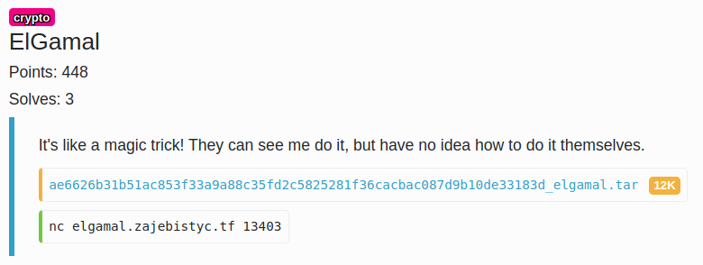
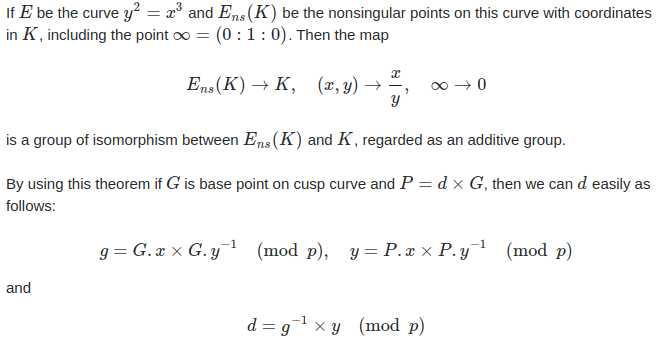

+++
title = 'CONFidence CTF 2020 Finals — ElGamal'
date = 2020-09-09T01:05:54+05:00
tags = ['ctf', 'writeup', 'crypto']
toc = true
tldr = 'mapping to the additive group using invalid curve attack'
+++



## Challenge sources

The given tar-archive contains two files: 

- **Challenge.cabal** — challenge package description designed in [Cabal](https://www.haskell.org/cabal/):

```
name:                Challenge
version:             0.1.0.0
build-type:          Simple
cabal-version:       >=1.10

executable Challenge
  main-is:             Main.hs
  build-depends:       base,
                       arithmoi,
                       bytestring,
                       cryptonite,
                       crypto-api,
                       safe
  default-language:    Haskell2010
```

- **Main.hs** — server source code written in Haskell:

```haskell
import           Control.Exception
import           Control.Monad
import           Crypto.PubKey.ECC.Types
import           Crypto.PubKey.ECC.Prim
import           Crypto.Util
import qualified Data.ByteString as B
import           Data.Foldable
import           Data.Maybe
import           Math.NumberTheory.Primes
import           Math.NumberTheory.Moduli.Sqrt
import           Safe
import           System.IO

curve = getCurveByName SEC_p256k1
curve_fp = case curve of CurveFP cfp -> cfp
p = ecc_p curve_fp
pp = fromJust (isPrime p)
a = ecc_a $ common_curve curve
b = ecc_b $ common_curve curve

main :: IO ()
main = do
  hSetBuffering stdout NoBuffering
  x <- scalarGenerate curve
  let h = pointBaseMul curve x
  putStrLn $ "I, Giorno Giovanna, have an ElGamal public key: " ++ show h
  result <- try $ sequence_ $ replicate 5 $
    menu [("Encrypt", encrypt h),
          ("Decrypt", decrypt x),
          ("Get flag", userAskedForFlagLol x)]
  case result of
    Left (ErrorCall msg) -> putStrLn $ msg ++ ". Bye!"
    Right _ -> putStrLn "Okay, that's enough. I ain't got all day."

encrypt :: Point -> IO ()
encrypt h = do
  putStr "Message: "
  msg <- B.getLine
  y <- scalarGenerate curve
  let s = pointMul curve y h
  putStrLn $ "c1: " ++ show (pointBaseMul curve y)
  putStrLn $ "c2: " ++ show (pointAdd curve (encodeMessage msg) s)

decrypt :: PrivateNumber -> IO ()
decrypt x = do
  putStr "c1: "
  c1 <- readLn
  unless (isPointValid curve c1) $ do
    return (error "Point invalid")

  putStr "c2: "
  c2 <- readLn
  unless (isPointValid curve c2) $ do
    return (error "Point invalid")

  let s = pointMul curve x c1
  let s_inv = pointNegate curve s
  let m = pointAdd curve c2 s_inv
  print (decodeMessage m)

userAskedForFlagLol x = do
  putStrLn "Now, why would I ever give you that?"
  input <- readLn
  if input == x
  then do
    putStrLn "Ho... how did you get that?! I guess I have no choice..."
    flag <- readFile "flag.txt"
    putStrLn flag
    -- Not an error, but it's the easiest way to bail
    error "I hope you're happy"
  else do
    error "I knew you wouldn't convince me"

menu :: [(String, IO ())] -> IO ()
menu options = do
  putStrLn "What would you like to do?"
  foldM_ showOption 1 options
  choice <- readLn
  case atMay options (choice - 1) of
    Just (_, op) -> op
    Nothing -> error "That does not look like one of the options"
  where
  showOption index (name, _) = do
    putStrLn $ "[" ++ show index ++ "] " ++ name
    return $ index + 1

encodeMessage :: B.ByteString -> Point
encodeMessage = encodeInteger . bs2i

decodeMessage :: Point -> B.ByteString
decodeMessage = i2bs_unsized . decodeInteger

discardBits = 8
maxMessage = p `div` 2^discardBits

encodeInteger :: Integer -> Point
encodeInteger n
  | n > maxMessage = error "Message too long"
  | n == maxMessage = PointO
  | otherwise =
      case asum [findY $ n * 2^discardBits + k | k <- [0..2^discardBits-1]] of
        Just p -> p
        Nothing -> error "Go play the lottery or something"

decodeInteger :: Point -> Integer
decodeInteger PointO = maxMessage
decodeInteger (Point x y) = x `div` 2^discardBits

findY :: Integer -> Maybe Point
findY x = Point x <$> listToMaybe (sqrtsModPrime (x^3 + a*x + b) pp)
```


## Analyzing source code

Let's look on these files. 

First we'll consider that Cabal package file may be useful later, when we would run the Haskell application locally. So we will start analyzing the Haskell code. Since it's a bit unusual to see Haskell code in the crypto challenge, the reading itself isn't too hard. After spending a few minutes I could slightly understand what's going on.

Okay, so we're working with some [Elliptic curve](https://en.wikipedia.org/wiki/Elliptic-curve_cryptography). The analysis of encrypt/decrypt functions (or just reading the challenge's name) helps us to guess the encryption scheme — it's [ElGamal](https://en.wikipedia.org/wiki/ElGamal_encryption). So, here is ElGamal scheme over the Elliptic curve, right? Yea, looks secure, because [discrete logarithm problem](https://en.wikipedia.org/wiki/Discrete_logarithm) is still hard on Elliptic curves (this probem is also known as ECDLP).

The curve is `secp256k1`, it's a well-known Elliptic curve, and it provides _enough_ security for this challenge. This curve is even [used by Bitcoin](https://en.bitcoin.it/wiki/Secp256k1). Since we're working over that curve, let's start our exploit with curve parameters. We denote the curve $E$ and its base point $G$:

```python
#!/usr/bin/env sage

p = 0xFFFFFFFFFFFFFFFFFFFFFFFFFFFFFFFFFFFFFFFFFFFFFFFFFFFFFFFEFFFFFC2F
F = GF(p)
E = EllipticCurve(F, [0, 7])
G = E(0x79BE667EF9DCBBAC55A06295CE870B07029BFCDB2DCE28D959F2815B16F81798,
      0x483ADA7726A3C4655DA4FBFC0E1108A8FD17B448A68554199C47D08FFB10D4B8)
```

I'll describe a bit what the server does:

- First it generates an integer $x$ — ElGamal **private key**. Next it computes $H = x \cdot G$ (where $G$ is the curve base point) and prints out $H$ — ElGamal **public key**. Since we know the curve, we know all the parameters, except for $x$. Our goal is find out $x$ and break the cryptosystem.

- Then the server gives us 5 attempts to encrypt and decrypt arbitrary messages. We also could ask for the flag, but we need to know the private key. When we send correct $x$ to the server, it will print the flag. But if our $x$ is invalid, the server drops the connection.

- How does the server stores a message inside the Elliptic curve? It just transforms it into the Elliptic curve point! Suppose we have an integer $M$ — our message. Server considers $M$ as a part of point's X-coordinate: it multiplies $M$ by 256 and bruteforces the least significant byte, until it get the correct X-coordinate. Pseudocode:

```
M = <our message>
for i in range(256):
    x = M * 256 + i
    if secp256k1 contains a point with such x:
        return (x, y)
```

- Retrieving message process is similar: the server just takes the X-coordinate and divides it by 256. But there was some unexpected text-encoding of non-printable characters. For example: `"])\229\243Jb)L\200\163\139\239\236U:\ENQ&t\RSH5,\152a\233\227\DC4)\bf\221"`. I don't know what it is, so my teammate [@ilyaluk](https://t.me/ilyaluk) helped me and wrote the decoder:

```python
def unescape(s):
    ascii_controls = [
        (b'\\a', b'\x07'),
        (b'\\b', b'\x08'),
        (b'\\f', b'\x0C'),
        (b'\\n', b'\x0A'),
        (b'\\r', b'\x0D'),
        (b'\\t', b'\x09'),
        (b'\\v', b'\x0B'),
        (b'\\"', b'\x22'), # ???
        (b'\\\'', b'\x27'), # ???
        (b'\\\\', b'\x5C'), # ???
        (b'\\NUL', b'\x00'),
        (b'\\SOH', b'\x01'),
        (b'\\STX', b'\x02'),
        (b'\\ETX', b'\x03'),
        (b'\\EOT', b'\x04'),
        (b'\\ENQ', b'\x05'),
        (b'\\ACK', b'\x06'),
        (b'\\BEL', b'\x07'),
        (b'\\BS', b'\x08'),
        (b'\\HT', b'\x09'),
        (b'\\LF', b'\x0A'),
        (b'\\VT', b'\x0B'),
        (b'\\FF', b'\x0C'),
        (b'\\CR', b'\x0D'),
        (b'\\SO', b'\x0E'),
        (b'\\SI', b'\x0F'),
        (b'\\DLE', b'\x10'),
        (b'\\DC1', b'\x11'),
        (b'\\DC2', b'\x12'),
        (b'\\DC3', b'\x13'),
        (b'\\DC4', b'\x14'),
        (b'\\NAK', b'\x15'),
        (b'\\SYN', b'\x16'),
        (b'\\ETB', b'\x17'),
        (b'\\CAN', b'\x18'),
        (b'\\EM', b'\x19'),
        (b'\\SUB', b'\x1A'),
        (b'\\ESC', b'\x1B'),
        (b'\\FS', b'\x1C'),
        (b'\\GS', b'\x1D'),
        (b'\\RS', b'\x1E'),
        (b'\\US', b'\x1F'),
        (b'\\SP', b'\x20'),
        (b'\\DEL', b'\x7F'),
    ]

    for fr, t in ascii_controls:
        s = s.replace(fr, t)
    for i in range(256):
        s = s.replace(b'\\' + str(i).zfill(3).encode('ascii'), bytes([i]))
    return s
```

So, now we completely understand what the server does. Let's try to find some vulnerabilities.


## Invalid curve attack

There are no obvious vulnerabilities, because `secp256k1` is _secure_ itself, and the code ensures all required security checks. Since we need to recover $x$, I started to analyze `decrypt` function, because it was the only one place in the whole code where $x$ is used. Here is `decrypt` pseudocode:

```
def decrypt(x):
    c1 = input point
    assert c1 is on secp256k1

    c2 = input point
    assert c2 is on secp256k1

    s = x * c1
    s_inv = -s
    m = c2 + s_inv # c2 - s
    return m
```
 
Luckily, we control the point $c_1$, which are multiplied by $x$! Looks like a clue. Since we know $c_1$, $c_2$ and resulting $m$, we can reverse all transformations and retrieve $s$. But discrete logarithm is still hard.

First I started to think about [Small subgroup attack](https://en.wikipedia.org/wiki/Small_subgroup_confinement_attack), but quickly realized that the curve base point $G$ has prime order (quite expected). Suddenly my teammate [@CerebralObserver](https://t.me/CerebralObserver) pointed out that some security check **does not hold**! More precisely, this code just does nothing (I don't know Haskell, so I don't understand why, but it's a fact). These errors are never thrown:

```
putStr "c1: "
c1 <- readLn
unless (isPointValid curve c1) $ do
    return (error "Point invalid")

putStr "c2: "
c2 <- readLn
unless (isPointValid curve c2) $ do
    return (error "Point invalid")
```

When we're working with Elliptic curves, we need to ensure that all points _are_ on the curve. It means if we have a point $(x_0, y_0)$ we need to check the equation $y_0^2 = x_0^3 + ax_0 + b$ (where $y^2 = x^3 + ax + b$ is our Elliptic curve). If the equation does not hold (or we just don't check it), the cryptosystem becomes vulnerable to [Invalid curve attack](https://blog.trailofbits.com/2018/08/01/bluetooth-invalid-curve-points/).

This attack exploits the fact that we are able to send _fake_ point to the server, and it will perform all Elliptic curve operations with our _fake_ point. To understand the attack, let's look at the Elliptic curve [addition law](https://en.wikipedia.org/wiki/Elliptic_curve#The_group_law). If we want to calculate $R = P + Q$, here are two main cases:

- $P \neq Q$

$ \hspace{1cm} s = \dfrac{P_y - Q_y}{P_x - Q_x} $

$ \hspace{1cm} R_x = s^2 - P_x - Q_x $

$ \hspace{1cm} R_y = P_y + s \cdot (R_x - P_x) $

- $P = Q$

$ \hspace{1cm} s = \dfrac{3 \cdot P_x^2 + a}{2 \cdot P_y} $

$ \hspace{1cm} R_x = s^2 - 2 \cdot P_x $

$ \hspace{1cm} R_y = P_y + s \cdot (R_x - P_x) $


As you see, the addition law uses **at most** $a$ coefficient from the Elliptic curve equation, and $b$ is never used! So without the correct curve check we could send a _fake_ point from **another** Elliptic curve (with another $b$ coefficient)! Thats why the attack called Invalid curve — we send a _fake_ point from Invalid (less secure) curve, but the secret remains the same. Using known vulnerabilities in our Invalid curve we could "easily" find the discrete logarithm.


## Mapping to additive group

How Invalid curve attack could be exploitable in our case? Let's look at the `secp256k1` equation again:

```
y^2 = x^3 + 7 (mod 0xFFFFFFFFFFFFFFFFFFFFFFFFFFFFFFFFFFFFFFFFFFFFFFFFFFFFFFFEFFFFFC2F)
```

See this? $a = 0$! And we also could make $b = 0$, using Invalid curve attack. With $a = 0$ and $b = 0$ our equation becomes "more simple": 

```
y^2 = x^3 (mod 0xFFFFFFFFFFFFFFFFFFFFFFFFFFFFFFFFFFFFFFFFFFFFFFFFFFFFFFFEFFFFFC2F)
```

So, we can send a point from a [cusp](https://en.wikipedia.org/wiki/Cusp_(singularity)):


Cusp has well-known property, which becomes useful in our case. One can construct a map from the cusp to an additive group. And the discrete logarithm in an additive group is just **division**:



_source: [https://crypto.stackexchange.com/a/67120](https://crypto.stackexchange.com/a/67120)_

So our plan is:

1. Send a point $c_1 = \text{Point 1 1}$, $c_2 = \text{PointO}$ (point at infinity)
2. Receive $-s = -(x \cdot c1)$. Set $Q = -s$ (using guessing a point Y-coordinate with 1-byte bruteforce)
3. Calculate $x = -\dfrac{Q_x}{Q_y}$ (where $x$ is private key)
4. Send $x$ and get the flag!


## Final exploit

```python
#!/usr/bin/env sage

import socket


p = 0xFFFFFFFFFFFFFFFFFFFFFFFFFFFFFFFFFFFFFFFFFFFFFFFFFFFFFFFEFFFFFC2F
F = GF(p)
E = EllipticCurve(F, [0, 7])
G = E(0x79BE667EF9DCBBAC55A06295CE870B07029BFCDB2DCE28D959F2815B16F81798,
      0x483ADA7726A3C4655DA4FBFC0E1108A8FD17B448A68554199C47D08FFB10D4B8)


def unescape(s):
    ascii_controls = [
        (b'\\a', b'\x07'),
        (b'\\b', b'\x08'),
        (b'\\f', b'\x0C'),
        (b'\\n', b'\x0A'),
        (b'\\r', b'\x0D'),
        (b'\\t', b'\x09'),
        (b'\\v', b'\x0B'),
        (b'\\"', b'\x22'), # ???
        (b'\\\'', b'\x27'), # ???
        (b'\\\\', b'\x5C'), # ???
        (b'\\NUL', b'\x00'),
        (b'\\SOH', b'\x01'),
        (b'\\STX', b'\x02'),
        (b'\\ETX', b'\x03'),
        (b'\\EOT', b'\x04'),
        (b'\\ENQ', b'\x05'),
        (b'\\ACK', b'\x06'),
        (b'\\BEL', b'\x07'),
        (b'\\BS', b'\x08'),
        (b'\\HT', b'\x09'),
        (b'\\LF', b'\x0A'),
        (b'\\VT', b'\x0B'),
        (b'\\FF', b'\x0C'),
        (b'\\CR', b'\x0D'),
        (b'\\SO', b'\x0E'),
        (b'\\SI', b'\x0F'),
        (b'\\DLE', b'\x10'),
        (b'\\DC1', b'\x11'),
        (b'\\DC2', b'\x12'),
        (b'\\DC3', b'\x13'),
        (b'\\DC4', b'\x14'),
        (b'\\NAK', b'\x15'),
        (b'\\SYN', b'\x16'),
        (b'\\ETB', b'\x17'),
        (b'\\CAN', b'\x18'),
        (b'\\EM', b'\x19'),
        (b'\\SUB', b'\x1A'),
        (b'\\ESC', b'\x1B'),
        (b'\\FS', b'\x1C'),
        (b'\\GS', b'\x1D'),
        (b'\\RS', b'\x1E'),
        (b'\\US', b'\x1F'),
        (b'\\SP', b'\x20'),
        (b'\\DEL', b'\x7F'),
    ]

    for fr, t in ascii_controls:
        s = s.replace(fr, t)
    for i in range(256):
        s = s.replace(b'\\' + str(i).zfill(3).encode('ascii'), bytes([i]))
    return s


def read_public_key(file):
    text = b'I, Giorno Giovanna, have an ElGamal public key: '
    line = file.readline().strip().decode()
    point_info = line[len(text):].split(' ')
    return tuple(map(int, point_info[1:]))


def decrypt_message(file, c1, c2):
    text = b'c1: c2: '
    file.write(f'2\n{c1}\n{c2}\n'.encode())
    file.flush()
    for _ in range(4):
        file.readline()
    return file.readline()[len(text):].strip()[1:-1]


def get_flag(file, x):
    file.write(f'3\n{x}\n'.encode())
    file.flush()
    for _ in range(6):
        file.readline()
    return file.readline().strip().decode()


def main(address):
    while True:
        with socket.socket(socket.AF_INET, socket.SOCK_STREAM) as sock:
            sock.settimeout(3)
            sock.connect(address)
            file = sock.makefile('rwb')
            H = E(read_public_key(file))
            message = decrypt_message(file, 'Point 1 1', 'PointO')
            _x = int.from_bytes(unescape(message), 'big')
            for dx in range(256):
                x = F(_x * 256 + dx)
                if not (x ^ 3).is_square():
                    continue
                y = (x ^ 3).sqrt()
                secret = int(-(x / y))
                if secret * G == H:
                    print(get_flag(file, secret))
                    return


if __name__ == '__main__':
    # main(('0.0.0.0', 31337))
    main(('elgamal.zajebistyc.tf', 13403))
```

Flag: `p4{t0O_l4zy_t0_ev@luat3_th3_many_p0ss1bl3_j0k3s_I_c@n_m@k3_h3r3}`

Many thanks to the author, the challenge is great!
