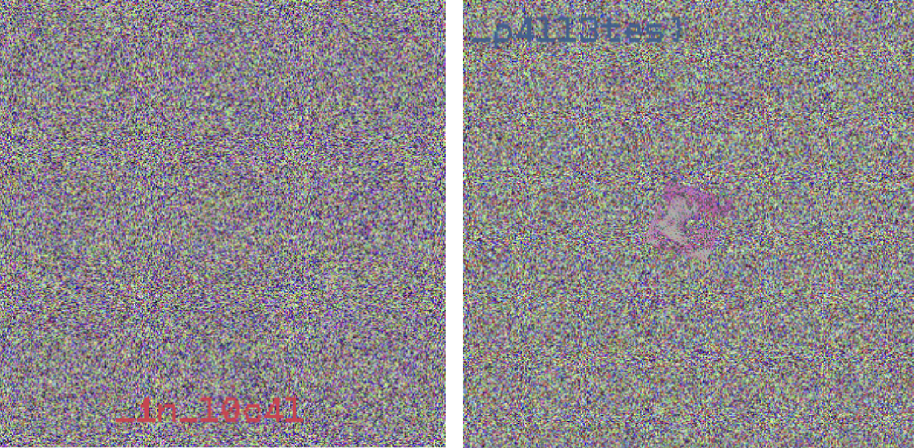

+++
title = 'SAS CTF 2025 — Lirili Larila'
date = 2025-05-27T02:21:11+05:00
tags = ['ctf', 'writeup', 'stegano']
toc = true
tldr = 'inspecting the local palettes of GIF frames'
+++

## Overview

Description:

> Please rate up my recent artwork made in a 10-hour lungo-infused drawing session

We're given the following GIF image:


## Investigation

Since it's a steganography challenge, we have to find a hidden flag inside the image file.

I've started with enumerating all frames using PIL:

```python
from PIL import Image

image = Image.open('stego.gif')
frames = []

for i in range(image.n_frames):
    image.seek(i)
    frames.append(image.copy())

for frame in frames:
    print(frame)
```

The image contains 68 frames:

```
<PIL.Image.Image image mode=P size=384x384 at 0x102647E20>
<PIL.Image.Image image mode=RGB size=384x384 at 0x104730520>
<PIL.Image.Image image mode=RGB size=384x384 at 0x104730A30>
...
<PIL.Image.Image image mode=RGB size=384x384 at 0x1047E6F80>
<PIL.Image.Image image mode=RGB size=384x384 at 0x1047E7130>
```

Note that the first frame has mode `P` that means the frame has a palette. A palette is a mapping from a single byte to the RGB color, therefore all pixels in the frame are 1-byte values (value is an index in the palette). When the frame is displayed, the color is taken from the palette by its index.

Let's look at the palette itself:

```python
> frames[0].palette.colors
{(255, 255, 255): 0}
```

The entire 256 values in the palette maps `#FFFFFF` color (white). That's expected, since the first frame of the GIF is a blank white image:


But what's the reason to embed a 768-bytes palette in order to draw a single-color image? Let's look at the image content:

```python
> frames[0].tobytes()[:128]
b"\xd1\xd1\xf0\x9e`\xf8'\x03\x88F5\x1e\xdc F\x16\x14@]B\xca6E\xed\x85\xd5\x92\x7f\x9e\xe7J<\x07\xfee\xf9\xa7\xa1kx\xd4\xbe\xc3\x9f\xe0\x7f\xedkA\xdf\x94.\x0c\xa3\xc8\xd6\xd2\x1c\xd0^\xefdd,\xfeH\x9fa\xdf\xf1W\x8am\x1e.\x95\xb41\xf4j\xfab\xb6\x8c\x9cJ\x1aD\x0fX{i\xa4\x83\xfc\xc2\xa6\xa2\xb0\xe6\x96C\xc2Y\x94p\xca\x15J\x8d\x04S,\x07\xaf\xf6\xc8\xe2R\xda\x821\xe1\xf4;\xa0\x03D"
```

The used palette indices are different, but they were mapped to the same white color. Let's try to randomize palette, we will assign random color to the each index:

```python
import os

palette = frames[0].getpalette()
palette = os.urandom(len(palette))
frames[0].putpalette(palette)

frames[0].show()
```

We immediately see the first part of the flag:


But where are the remaining parts?

## More investigation

The GIF could contain two types of palette:

- **global** palette is a single palette for entire GIF file
- **local** palettes are assigned to each frame

The palette we've seen above is an example of a **local** palette assigned to the first frame. Remember that, according to PIL, other frames do not contain any palettes, since their modes are `RGB`, not `P`.

I've attempted to search the remaining parts of the flag using different methods:

- resizing the frame bounds
- taking LSB of each frame
- using open source steganography tools
- comparing to the original Lirili Larila image
- etc...

After some trial and error I started to doubt that PIL is correct. The first attempt was to search more palettes in the image. Since the first palette contains 256 white colors, it represented as `b'\xff\xff\xff'*256` bytes.

Let's search for this byte string:

```python
with open('stego.gif', 'rb') as file:
    data = file.read()

count = data.count(b'\xff\xff\xff'*256)
print(count)
```

It turned out that the image contains 7 different blocks of `b'\xff\xff\xff'*256`. That's not unusual since the image contains other blank white frames, but I've tried to recheck it. The simplest way as before, just replace the palette with random colors:

```python
palette = os.urandom(3*256)
replaced = data.replace(b'\xff\xff\xff'*256, palette)

with open('replaced.gif', 'wb') as file:
    file.write(replaced)
```

Let's look at the result:


Do you see the other parts of the flag among the noise?


That's a huge progress:

```
SAS{50m3_3leph4n7s_c4n_h1d3_7h31r_53cr3ts
```

But we still haven't got a closing bracket...

## Solution

It seems that PIL works with local palettes incorrectly (or I'm using it wrong), so I've decided to use Golang. Luckily Golang has a builtin [image/gif](https://pkg.go.dev/image/gif) package in its standard library.

Let's replace the local palette of each frame using Golang:

```go
package main

import (
	"image/color"
	"image/gif"
	"log"
	"math/rand"
	"os"
	"time"
)

func randomPalette() color.Palette {
	palette := make(color.Palette, 256)

	for i := range palette {
		palette[i] = color.RGBA{
			R: uint8(rand.Intn(256)),
			G: uint8(rand.Intn(256)),
			B: uint8(rand.Intn(256)),
		}
	}

	return palette
}

func main() {
	rand.Seed(time.Now().UnixNano())

	in, err := os.Open("stego.gif")
	if err != nil {
		log.Fatal(err)
	}
	defer in.Close()

	image, err := gif.DecodeAll(in)
	if err != nil {
		log.Fatal(err)
	}

	for _, frame := range image.Image {
		frame.Palette = randomPalette()
	}

	out, err := os.Create("output.gif")
	if err != nil {
		log.Fatal(err)
	}
	defer out.Close()

	err = gif.EncodeAll(out, image)
	if err != nil {
		log.Fatal(err)
	}
}
```

It works, we've added more noise:


And we immediately see the remaining parts of the flag:



## Flag

```
SAS{50m3_3leph4n7s_c4n_h1d3_7h31r_53cr3ts_1n_l0c4l_p4ll3tes}
```

## Conclusion

Despite the challenge has 25 solves, my solution took several hours, since I didn't realize that PIL spoofed me and there are more local palettes. But I definitely liked it because that's an example of good steganography challenge: the secret is hidden inside the container structure, and no guessy tools and papers are required.
